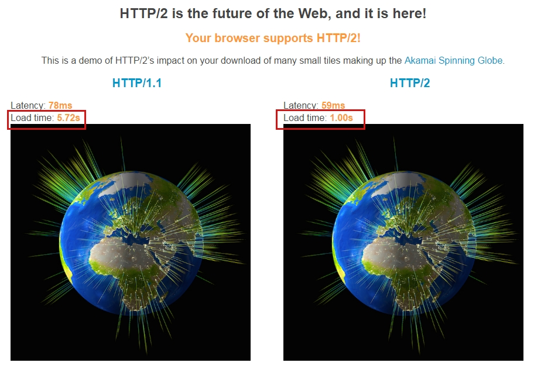

## 一、HTTP/2简介

`HTTP/2`标准于2015年5月以`RFC 7540`正式发表，替换`HTTP/1.1`成为`HTTP`的实现标准。

`HTTP/2`保留、兼容`HTTP/1.1`的所有语义，与`HTTP/1.*`相比，主要区别包括：

1. `HTTP/2`采用二进制格式而非文本格式
	* 高效紧凑传输解析
	* 更少错误倾向，没有了所谓的空白行、大写、换行符、空连接等
2. `HTTP/2`是完全多路复用的，而非有序并阻塞的
	* `HTTP/1.1`默认情况下单个请求单个连接
	* `HTTP/1.1`流水线化`pipelining`方式导致较大/较慢的响应阻塞后续任务
	* `HTTP/1.1`无法解决线头阻塞的问题
	* 多路复用可以有效避免线头阻塞，多个请求-响应同一个连接内并行处理
3. 只需一个连接即可实现并行
	* `HTTP/1.*`多个连接会占用过多网路资源，导致`TCP`堵塞和数据重传
	* `HTTP/2`单个连接内多个流（请求-响应）之间并行处理，减少网路资源占用，可避免了`TCP`频繁的打开、关闭
4. 使用报头压缩，`HTTP/2`降低了开销
	* 传统浏览器网路报头一般在80-1400字节大小
	* 压缩头部可让报头更紧凑，更快速传输，有利于移动网络环境等
	* 压缩算法使用`HPACK`，更为高效、安全
5. `HTTP/2`让服务器可以将响应主动“推送”到客户端
	* 传统方式：客户端请求，服务器响应，客户端逐一解析需要后续请求的图片、样式等资源，再次一一发送资源请求
	* `HTTP/2`服务器根据客户端请求，计算出响应内容所包含的资源，在客户端发起请求之前提前发送给客户端
	* 节省客户端主动发起请求的时间的往返时间

总的来说，就是`HTTP/2`更快更省更安全。
 
 
## 二、HTTP/2性能对比

[https://http2.akamai.com/demo](https://http2.akamai.com/demo) 是`Akamai`公司建立的一个官方的演示，用以说明`HTTP/2`相比于之前的`HTTP/1.1`在性能上的大幅度提升。从Load time的对比可以很直观的看到两者的速度差异：

该页面包含`HTTP/1.1`和`HTTP/2`两个frame，每一个frame包含364个请求，其中361个请求返回的图片组成中间的大图。

* 请求时间对比：
反复加载两个frame各十次，测试两者的请求加载时间，取平均值：

|Protocol|Load Time|
|:---:|:---:|
| HTTP/1.1 | 6.71s |
| HTTP/2 | 0.92s |

相比之下`HTTP/2`减少了86%的请求时间

* 请求开销对比
demo中364个请求合并长度：

|Protocol|size|
|:---:|:---:|
| HTTP/1.1 | 864KB |
| HTTP/2 | 796KB |

 相比之下`HTTP/2`减少了7.8%的请求开销

总结：从实际测试结果来看，`HTTP/2`能有效降低整体开销，特别是多路复用和并行请求，大幅度的减少请求时间，意义明显。

## 三、浏览器和服务端的支持

目前主流浏览器`Chrome`, `Opera`, `Firefox`, `IE 11`, `Safari`, `Amazon Silk`和`Edge`都支持`HTTP/2`。

需要注意的是`HTTP/2`协议本身并没有要求它必须基于`TLS（HTTPS）`部署，但当前主流浏览器包括`Chrome`、`firefox`，都明确只支持基于`TLS`部署的`HTTP/2`，因此对于服务端来说，就必须支持`ALPN`（`ALPN`是什么，这里有介绍[Introducing ALPN](http://www.eclipse.org/jetty/documentation/current/alpn-chapter.html)）来完成`HTTP/2`的协议协商。

大部分`Web Server`都依赖`OpenSSL`库提供`TLS`，对于它们来说，是否支持`ALPN`完全取决于使用的`OpenSSL`版本，从`OpenSSL 1.0.2`开始支持`ALPN`。

对于协商不到`HTTP/2`的请求，将会降级到`HTTP/1.1`来完成请求，没有兼容性问题。
 
## 四、客户端的支持
 
 `iOS`方面，`Apple`对于`HTTP/2`的态度非常积极，从`iOS9`开始，提供了`NSURLSession`库用于支持`HTTP/2`。

而要`Android`支持`HTTP/2`，首先离不开`Java`的支持。从公开文献得知，`HTTP/2`和`ALPN`被包含了在`Java9`的新特性中，而`Java9`已经跳票到2017年7月。。。

那是不是就没法在`Android`客户端中使用`HTTP/2`了呢？

我们知道`Android API`中用于完成网络请求的`URLConnection`库已经在`Andriod 4.x`时代被替换成了基于`OkHttp`的实现，而不再是原本的`Java`封装。

从`OkHttp`官网得知，从`OkHttp2.5`版本开始支持`HTTP/2`和`ALPN`，但仅限于`Android 5.0`系统以上，由于我们不知道基于`OkHttp`封装的`URLConnection`所使用的版本，因此我们需要测试验证一下。

测试环境：

* 服务端：`nginx 1.11.4`, `openssl1.1.0`，开启`HTTP/2`, `TLS`
* 客户端：`Android4.4`, `5.1`, `6.0`设备各一

测试过程为分别通过`URLConnection`和`OkHttp3.4.1`发起网络请求，通过服务端log可以观察到客户端的请求是否协商`HTTP/2`成功，还是被降级到`HTTP/1.1`，验证结果如下：

| * |Android4.4|Android5.1|Android6.0|
|:---:|:---:|:---:|:---:|
|URLConnection |	HTTP/1.1 | HTTP/1.1 |	 HTTP/1.1|
|OkHttp3.4.1 | HTTP/1.1 | HTTP/2 | HTTP/2| 

由此可以看出，`Android API`原生不支持`HTTP/2`，而在`Android 5.0`以上的系统中，可以通过第三方库`OkHttp`来完成`HTTP/2`的请求。
 

## 五、总结

1. 相对于文本传输、串行处理的`HTTP/1.1`，`HTTP/2`的二进制传输、报头压缩、多路复用等技术，无论是整体开销还是请求时间，性能优势明显，特别是在实际测试中，请求加载时间录得高达86%的提升；
2. 主流浏览器内核都已经支持基于`TLS`的`HTTP/2`；
3. `Android API`原生不支持`HTTP/2`，而在`Android 5.0`以上的系统中，可以通过第三方库`OkHttp`来完成`HTTP/2`的请求。

后记：在部署`HTTP/2`服务，编写`Android demo`发起`HTTPS`、`HTTP/2`请求的时候着实费了一番周折，篇幅所限，将会在另一篇文章总结出来，以免以后再走弯路。