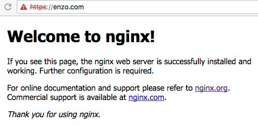

看了很多关于```HTTP/2```的优势、性能如何如何提升的文章，可是对于```Android```客户端开发来说，```Android API```要是不支持，也是白搭啊。度娘说，要客户端支持```HTTP/2```，首先要支持```ALPN```（```ALPN```是什么，这里有介绍[Introducing ALPN](http://www.eclipse.org/jetty/documentation/current/alpn-chapter.html)）

而要```Android```支持```HTTP/2```，首先离不开```Java```的支持。从公开资料得知，```HTTP/2```和```ALPN```被包含了在```Java9```的新特性中，而```Java9```已经跳票到2017年7月。。。隔壁的```iOS```从9开始就提供API支持了。。。蓝瘦，香菇

等等，我们知道```Android API```中用于完成网络请求的```URLConnection```已经在```Andriod 4.x```时代被替换成了基于```OkHttp```的实现，而不再是原本的```Java```封装，那```OkHttp```能支持不就可以了吗。


 刚进入```OkHttp```官网首页，就看到了硕大的```HTTP/2```字样，一阵狂喜，查看changelog，发现从```Version 1.5.0```开始就支持```ALPN```了，可是仅限于```Android4.4+```：

* New: Use ALPN on Android platforms that support it (4.4+)

不管怎样总算看到一线希望，只是用于封装```URLConnection```的是哪个版本呢，能不能支持```HTTP/2```呢，动手写个demo试试吧。

 

--------------------------------高端大气上档次的分割线----------------------------

要测试```HTTP/2```，首先要有个server，自己动手，听说```nginx```支持```HTTP/2```的部署，那就你了

### 一、安装nginx

到[http://nginx.org/en/download.html](http://nginx.org/en/download.html)，```nginx```已经为```windows```编译好，直接下载就可以用。

进入```nginx```目录

```bash
start nginx
```

度娘说，```HTTP/2```需要基于```TLS```，也就是先得部署```HTTPS```，部署```HTTPS```需要签名，据说有免费的签名可以申请，不过也可以自签名：

### 二、生成证书

上```OpenSSL```下载，安装，

在```nginx```根目录下新建```ssl```文件夹(名字可以自己定)，

```bash
#此步用于生成私钥，会提示输入密码，密码后面步骤需要用到；enzo.key为私钥的名字，文件名可自己定
openssl genrsa -des3 -out enzo.key 1024
#此步用于生成csr证书，enzo.key为上一步骤生成的私钥名，enzo.csr为证书，证书文件名可自定
#在此步过程中，会交互式输入一系列的信息(所在国家、城市、组织等)，其中Common Name一项代表nginx服务访问用到的域名，我这里是本地测试，所以可以随意定一个jason.com，并在本地host文件中将此域名映射为127.0.0.1
openssl req -new -key enzo.key -out enzo.csr
#此步用于去除访问密码，如果不执行此步，在配置了ssl后，nginx启动会要求输入密码
#enzo.key为需要密码的key，enzo-np.key为去除访问密码的key文件
#操作过程中会要求输入密码，密码为生成key文件时的密码
openssl rsa -in enzo.key -out enzo-np.key
#此步用于生成crt证书
#enzo.crt为第2步生成的csr证书名称，enzo.crt为要生成的证书名称
openssl x509 -req -days 366 -in enzo.csr -signkey enzo-np.key -out enzo.crt
```

 经过以上几个步骤，证书生成完毕，```ssl```文件夹下的```enzo.crt```和```enzo-np.key```为我们后续要使用的文件。

注：在执行```openssl```命令时，可能会出现提示找不到```openssl```配置文件，

需要手动将```C:\OpenSSL-Win64\bin\openssl.cfg```重命名为```openssl.cnf```并copy到
```C:\Program Files\Common Files\SSL\```

### 三、部署HTTPS 和 HTTP/2

打开```nginx```目录下```conf\nginx.conf```文件，找到```HTTPS server```的配置，将配置项前面的注释符号去掉，然后修改如下：

```nginx
server {
        listen       443 ssl http2;
        server_name  front;


        ssl_certificate      ./ssl/enzo.crt;
        ssl_certificate_key  ./ssl/enzo-np.key;
        ssl_protocols TLSv1 TLSv1.1 TLSv1.2;
        #ssl_session_cache    shared:SSL:1m;
        ssl_session_timeout  5m;

        ssl_ciphers  HIGH:!aNULL:!MD5;
        ssl_prefer_server_ciphers  on;

        location / {
            root   html;
            index  index.html index.htm;
        }
    }
```
  
### 四、配置重定向

将```http```的请求重定向到```https```，只需要在```http```对应```server```配置中添加```rewrite```

```nginx
server {
        listen       80;
        server_name enzo.com;
        rewrite ^(.*) https://$server_name$1 permanent;
}
```
 由于指定了虚拟域名，还需要在```hosts```中将```enzo.com```指向本机```127.0.0.1```

### 五、加载nginx配置

```bash
D:\http2\nginx-1.11.4>nginx -s reload
nginx: [emerg] the "http2" parameter requires ngx_http_v2_module in D:\http2\nginx-1.11.4/conf/nginx.conf:98
```

 什么情况，缺少参数？？？马上```google```，原来是官方编译的时候没有带上```--with-http_v2_module```

### 六、重新编译nginx

要在```windows```下编译，太痛苦了吧，还是移师```mac```吧

重新编译```nginx```需要依赖以下模块：

* ```gzip```模块需要```zlib```库    ----  已经有了

* ```rewrite```模块需要```pcre```库   ---- 不需要编译，只需要编译```nginx```的时候指定源码路径

* ```ssl```功能需要```openssl```库    ----  已经有了，但是怕内建的版本太旧不支持```ALPN```，还是重新下载编译吧

#### 6.1 编译OpenSSL

在[http://www.openssl.org/source](http://www.openssl.org/source)下载当前最新的版本源码

解压缩```openssl-xx.tar.gz```包， 进入解压缩目录，执行：

```bash
./config
make
sudo make install
```

#### 6.2 编译OpenSSL

在[http://www.pcre.org](http://www.pcre.org)下载当前最新的版本的```pcre```源码

在[http://nginx.org/en/download.html](http://nginx.org/en/download.html)下载当前最新的版本的```nginx```源码

解压缩```pcre-xx.tar.gz```、```nginx-xx.tar.gz```包，进入解压缩目录，执行：

```bash
./configure --with-pcre=/Users/enzo/http2/pcre-8.39 --with-http_v2_module --with-http_ssl_module
make
sudo make install
```
 

### 七、重启打开nginx服务

重新放入证书，配置文件，配置```hosts```，进入```nginx/sbin```:

```bash
cd /usr/local/nginx/sbin
sudo ./nginx
```

 打开```chrome```，输入```https://enzo.com```

欧也




硕大的```h2```，看到没，部署成功了。

### 八、测试URLConnection
写个Demo，测一下```URLConnection```，因为是```HTTPS```，所以需要一个```SSLContext```，将前面生成的证书```enzo.crt```放到```assets```目录：

```java
public SSLContext getSSLContext() {
	    try {
			// 生成SSLContext对象
			SSLContext sslContext = SSLContext.getInstance("TLS");
			// 从assets中加载证书
			InputStream inStream = getAssets().open("enzo.crt");

			// 证书工厂this
			CertificateFactory cerFactory = CertificateFactory.getInstance("X.509");
			Certificate cer = cerFactory.generateCertificate(inStream);
 
			// 密钥库
			KeyStore kStore = KeyStore.getInstance("PKCS12");//如果是运行在PC端，这里需要将PKCS12替换成JKS
			kStore.load(null, null);
			kStore.setCertificateEntry("trust", cer);// 加载证书到密钥库中
 
			// 密钥管理器
			KeyManagerFactory keyFactory = KeyManagerFactory.getInstance(KeyManagerFactory.getDefaultAlgorithm());
			keyFactory.init(kStore, null);// 加载密钥库到管理器
 
			// 信任管理器
			TrustManagerFactory tFactory = TrustManagerFactory.getInstance(TrustManagerFactory.getDefaultAlgorithm());
tFactory.init(kStore);// 加载密钥库到信任管理器
 
			// 初始化
			sslContext.init(keyFactory.getKeyManagers(), tFactory.getTrustManagers(), new SecureRandom());
			return sslContext;
		} catch (UnrecoverableKeyException e) {
			e.printStackTrace();
		} catch (KeyManagementException e) {
			e.printStackTrace();
		} catch (NoSuchAlgorithmException e) {
			e.printStackTrace();
		} catch (CertificateException e) {
			e.printStackTrace();
		} catch (KeyStoreException e) {
			e.printStackTrace();
		} catch (IOException e) {
			e.printStackTrace();
		}
		return null;
	}
```

然后：

```java
public void testURLConnection() {
		try {
			String path = "https://enzo.com";
			// 新建一个URL对象
			URL url = new URL(path);
			
			// 打开一个HttpsURLConnection连接
			SSLContext sc = getSSLContext();
                        HttpsURLConnection.setDefaultSSLSocketFactory(sc.getSocketFactory());
			HttpsURLConnection conn = (HttpsURLConnection)  url.openConnection();
			
	                // 设置连接超时时间
			conn.setConnectTimeout(5 * 1000);
			// 开始连接
			conn.connect();
			// 判断请求是否成功
			if (conn.getResponseCode() == 200) {
				// 获取返回的数据
				byte[] data = readStream(conn.getInputStream());
				Log.i("---wyf---", "Get方式请求成功，返回数据如下：");
				Log.i("---wyf---", new String(data, "UTF-8"));
			} else {
				Log.i("---wyf---", "Get方式请求失败:"+conn.getResponseCode());
			}
			// 关闭连接
			conn.disconnect();
		} catch (Exception e) {
			e.printStackTrace();
		}
	}
```

找一个已root的4.4的手机，确保跟server处于同一个局域网，在手机的```hosts```将```enzo.com```指向server地址，运行demo，只见```nginx```的```access.log```中给你来了这么一行：

```bash
"GET / HTTP/1.1" 200 612 "-" "Dalvik/1.6.0 (Linux; U; Android 4.4.4; M463C Build/KTU84P)"
```

 被降级到```HTTP/1.1```了，那5.x的手机呢：

```bash
"GET / HTTP/1.1" 200 612 "-" "Dalvik/2.1.0 (Linux; U; Android 5.1.1; NX529J Build/LMY47V)"
```

 好吧，看来```URLConnection```是指望不上了


### 九、测试OkHttp

那么直接上```OkHttp```，下了个最新的3.4.1

```java
public void testOkHttp() {
		try {
			String path = "https://enzo.com";
			// 新建一个URL对象
			URL url = new URL(path);
			
			// 打开一个OkHttpClient连接
			SSLContext sc = getSSLContext();
			List<Protocol> protocols = new ArrayList<Protocol>();
			protocols.add(Protocol.HTTP_1_1);
			protocols.add(Protocol.HTTP_2);
			OkHttpClient client = new OkHttpClient.Builder().protocols(protocols)
			        .sslSocketFactory(sc.getSocketFactory())
			        .build();
			
			Request request = new Request.Builder().url(url).build();
		    Response response = client.newCall(request).execute();
		    if (response.isSuccessful()) {
		    	Log.i("---wyf---", "Get方式请求成功，返回数据如下：");
				Log.i("---wyf---", response.body().string());
				Log.d("---wyf---", "Protocol: " + response.protocol());
		    } else {
		    	Log.i("---wyf---", "Get方式请求失败:"+response);
		    }
	
		} catch (Exception e) {
			e.printStackTrace();
		}
	}
```

 4.4：

```bash
"GET / HTTP/1.1" 200 612 "-" "okhttp/3.4.1"
```

5.x：

```bash
"GET / HTTP/2.0" 200 729 "-" "okhttp/3.4.1"
```

又见```HTTP/2```!


所以```OkHttp``` & ```Android 5.0+``` 是可以实现```HTTP/2```访问的。


写在最后：

[Introducing ALPN](http://www.eclipse.org/jetty/documentation/current/alpn-chapter.html)的最后面，介绍了```“How to build ALPN”```，把```jetty ALPN```实现编译到```OpenJDK 7/8```里面去，也许也是个办法，但考虑到替换```OpenJDK```不太现实，所以没有进一步尝试。

