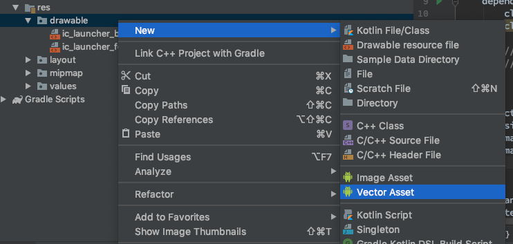
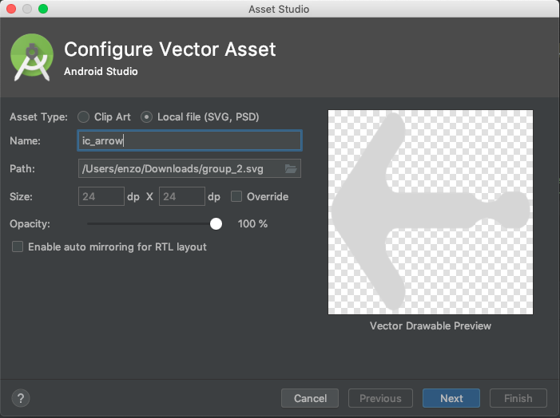
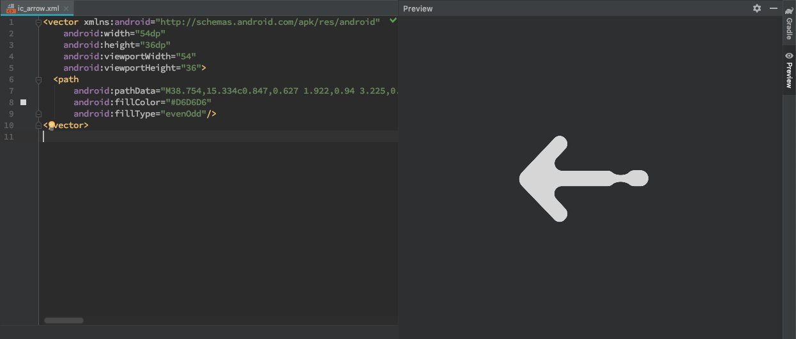

一直以来，在`Android`开发中使用的图片资源都是`jpg`或者`png`格式的。`Android`各种坑爹的分辨率，使得我们不得不为同一图片资源准备多份来适应不同的分辨率，导致最终安装包大小变的很大，即使如此也无法很好的解决问题。所以最近开始在手头的项目中尝试使用`SVG`。

> SVG -- 可缩放矢量图形（英语：Scalable Vector Graphics，SVG）是一种基于可扩展标记语言（XML），用于描述二维矢量图形的图形格式。SVG由W3C制定，是一个开放标准。----摘自[维基百科](https://zh.wikipedia.org/wiki/%E5%8F%AF%E7%B8%AE%E6%94%BE%E5%90%91%E9%87%8F%E5%9C%96%E5%BD%A2)

`SVG`很好的解决了适配分辨率的烦恼，作为矢量图形，可以做到无级放大且不会出现锯齿，同时自身由于是`xml`文件，自身体积也比较小，达到控制了安装包大小的目的。

在`Android`上使用`SVG`并不是直接把`SVG`文件直接拖入到工程资源文件夹中，而是需要转换成`VectorDrawable`或者绘制`Canvas`的代码。这里有个`SVG`描述的箭头：

```xml
<svg xmlns="http://www.w3.org/2000/svg" width="54" height="36" viewBox="0 0 54 36">
    <path fill="#D6D6D6" fill-rule="evenodd" d="M38.754 15.334c.847.627 1.922.94 3.225.94 1.336 0 2.38-.275 3.134-.826a3.242 3.242 0 0 1 2.428-1.09h2.5a3.25 3.25 0 1 1 0 6.5h-2.5a3.24 3.24 0 0 1-2.27-.926 6.718 6.718 0 0 0-3.292-.861c-1.111 0-2.126.267-3.042.802a2.992 2.992 0 0 1-2.217.978H18.054a3 3 0 0 0-2.206 5.034l3.735 4.05a3 3 0 0 1 .083 3.974l-.326.384a2.858 2.858 0 0 1-4.234.137L1.88 20.742a4 4 0 0 1-.015-5.544L15.135 1.32a2.868 2.868 0 0 1 4.229.092l.26.296a3 3 0 0 1-.08 4.043l-3.532 3.722a3 3 0 0 0 2.176 5.065H36.72c.785 0 1.5.302 2.034.795z"/>
</svg>
```

我们看看怎么做两种转换并使用：


## 一、VectorDrawable
`VectorDrawable`是`Google`从`Android 5.0`开始引入的一个专门用于处理矢量图的`Drawable`子类，并通过`support-library`向下支持到`Android 4.0`。

### 创建VectorDrawable
`VectorDrawable`一般不需要手动创建，而是通过`Android Studio`的新建`Vector Asset`文件功能，在项目`res\drawable`目录下点击鼠标右键可以看到：



点击进入：



* Asset Type： 选择`Local file`
* Name： 输入一个合适的文件名
* Path： 想要转换的`SVG`文件的路径
* Size： 如果原图是非正方形尺寸，一定要勾选`Override`，否则图形会被拉伸变形。具体尺寸那里默认即可。
* Opacity：根据具体需要输入。
* Enable auto mirroring for RTL layout：是否要自动适应右到左布局（阿拉伯国家的文字是右到左），一般不需要。

最后选择Next然后再Finish，就可以看到`res\drawable`目录下多了个刚刚你命名的`xml`文件，比如：

```xml
<vector xmlns:android="http://schemas.android.com/apk/res/android"
    android:width="54dp"
    android:height="36dp"
    android:viewportWidth="54"
    android:viewportHeight="36">
  <path
      android:pathData="M38.754,15.334c0.847,0.627 1.922,0.94 3.225,0.94 1.336,0 2.38,-0.275 3.134,-0.826a3.242,3.242 0,0 1,2.428 -1.09h2.5a3.25,3.25 0,1 1,0 6.5h-2.5a3.24,3.24 0,0 1,-2.27 -0.926,6.718 6.718,0 0,0 -3.292,-0.861c-1.111,0 -2.126,0.267 -3.042,0.802a2.992,2.992 0,0 1,-2.217 0.978H18.054a3,3 0,0 0,-2.206 5.034l3.735,4.05a3,3 0,0 1,0.083 3.974l-0.326,0.384a2.858,2.858 0,0 1,-4.234 0.137L1.88,20.742a4,4 0,0 1,-0.015 -5.544L15.135,1.32a2.868,2.868 0,0 1,4.229 0.092l0.26,0.296a3,3 0,0 1,-0.08 4.043l-3.532,3.722a3,3 0,0 0,2.176 5.065H36.72c0.785,0 1.5,0.302 2.034,0.795z"
      android:fillColor="#D6D6D6"
      android:fillType="evenOdd"/>
</vector>
```

`vector`标签表示这是一个`VectorDrawable`，这里可以看到几个属性：

* width & height： 图片宽高，对应`SVG`文件中的`width` &` height`。
* viewportWidth & viewportHeight： 用于定义`viewport`空间的宽高，对应`SVG`文件中的`viewBox`。`viewport`可以理解为绘制`paths`的画布，上面的例子可以理解为在54dp * 36 dp的空间里面，有 54 * 36个网格，图片的`paths`数据就绘制在这些网格当中。

内层的`path`标签描述的是`paths`绘制的信息，比如具体路径，画笔的颜色类型等等，上面例子出现的属性：

* pathData：绘制的具体路径，对应`SVG`文件中`path`标签下的`d`属性
* fillColor：画笔的颜色，对应`SVG`文件中`path`标签下的`fill`属性
* fillType：画笔的类型，对应`SVG`文件中`path`标签下的`fill-rule`属性。类型可以是`evenOdd`或`nonZero`。 有关更多详细信息，请参考([https://www.w3.org/TR/SVG/painting.html#FillRuleProperty](https://www.w3.org/TR/SVG/painting.html#FillRuleProperty))

这里只出现了部分属性，更多的属性请自行参考[https://developer.android.google.cn/reference/android/graphics/drawable/VectorDrawable](https://developer.android.google.cn/reference/android/graphics/drawable/VectorDrawable)，这里就不一一展开了。

上述的属性都可以自行修改，同时在`preview`界面可以很直观的观察修改效果：




### 使用VectorDrawable
首先需要给项目添加兼容性支持，在`build.gradle`脚本中添加：

```groovy
android { 
    defaultConfig { 
        vectorDrawables.useSupportLibrary = true 
    } 
}
```

`VectorDrawable`的使用跟一般的图片资源使用方式是一样的，比如用在`ImageView`上面：

```xml
<ImageView
   android:layout_width="100dp"
   android:layout_height="100dp"
   android:src="@drawable/ic_arrow"/>
```

或者作为背景：

```xml
<View
    android:layout_width="100dp"
    android:layout_height="100dp"
    android:background="@drawable/ic_arrow" />
```

是不是非常简单。

## 二、转换成Canvas
前面的`VectorDrawable`最终呈现，还是要绘制在`Canvas`上的，那可不可以直接将`SVG`转换成绘制`Canvas`的代码来使用呢？老外已经做了这个事情了：[SVG2Java/SVG2Android](https://codecrafted.net/svgtoandroid)

这是一个在线工具，只要上传`SVG`文件就可以很方便的生成`Java`代码，上面的箭头生成的代码如下：

```java
// TODO Include your package name here

import android.graphics.Canvas;
import android.graphics.Color;
import android.graphics.Matrix;
import android.graphics.Paint;
import android.graphics.Path;
import android.graphics.PorterDuff;
import android.graphics.PorterDuffColorFilter;

public class ArrowSvgObject {
    private static final Paint  p  = new Paint();
    private static final Paint  ps = new Paint();
    private static final Path   t  = new Path();
    private static final Matrix m  = new Matrix();
    private static float od;
    protected static ColorFilter cf = null;

    /**
     *  IMPORTANT: Due to the static usage of this class this
     *  method sets the tint color statically. So it is highly
     *  recommended to call the clearColorTint method when you
     *  have finished drawing. 
     *
     *  Sets the color to use when drawing the SVG. This replaces
     *  all parts of the drawable which are not completely
     *  transparent with this color.
     */
    public static void setColorTint(int color){
        cf = new PorterDuffColorFilter(color, PorterDuff.Mode.SRC_IN);
    }

    public static void clearColorTint(int color){
        cf = null;
    }

    public static void draw(Canvas c, int w, int h){
        draw(c, w, h, 0, 0);
    }

    public static void draw(Canvas c, int w, int h, int dx, int dy){
        float ow = 54f;
        float oh = 36f;

        od = (w / ow < h / oh) ? w / ow : h / oh;

        r();
        c.save();
        c.translate((w - od * ow) / 2f + dx, (h - od * oh) / 2f + dy);

        m.reset();
        m.setScale(od, od);

        c.save();
        ps.setColor(Color.argb(0,0,0,0));
        ps.setStrokeCap(Paint.Cap.BUTT);
        ps.setStrokeJoin(Paint.Join.MITER);
        ps.setStrokeMiter(4.0f*od);
        c.scale(1.0f,1.0f);
        c.save();
        p.setColor(Color.parseColor("#D6D6D6"));
        t.reset();
        t.moveTo(38.75f,15.33f);
        t.cubicTo(39.6f,15.96f,40.68f,16.27f,41.98f,16.27f);
        t.cubicTo(43.31f,16.27f,44.36f,16.0f,45.11f,15.45f);
        t.lineTo(50.04f,14.36f);
        t.lineTo(47.54f,20.86f);
        t.cubicTo(40.87f,19.07f,39.85f,19.34f,38.94f,19.87f);
        t.lineTo(18.05f,20.85f);
        t.lineTo(19.58f,29.94f);
        t.lineTo(19.34f,34.29f);
        t.lineTo(1.88f,20.74f);
        t.lineTo(15.13f,1.32f);
        t.lineTo(19.62f,1.71f);
        t.lineTo(16.01f,9.47f);
        t.lineTo(36.72f,14.54f);
        t.cubicTo(37.5f,14.54f,38.22f,14.84f,38.75f,15.33f);
        
        t.transform(m);
        c.drawPath(t, p);
        c.drawPath(t, ps);
        c.restore();
        r(1,0,3,2);
        p.setColor(Color.parseColor("#D6D6D6"));
        c.restore();
        r();

        c.restore();
    }

    private static void r(Integer... o){
        p.reset();
        ps.reset();
        if(cf != null){
            p.setColorFilter(cf);
            ps.setColorFilter(cf);
        }
        p.setAntiAlias(true);
        ps.setAntiAlias(true);
        p.setStyle(Paint.Style.FILL);
        ps.setStyle(Paint.Style.STROKE);
        for(Integer i : o){
            switch (i){
                case 0: ps.setStrokeCap(Paint.Cap.BUTT); break;
                case 1: ps.setColor(Color.argb(0,0,0,0)); break;
                case 2: ps.setStrokeMiter(4.0f*od); break;
                case 3: ps.setStrokeJoin(Paint.Join.MITER); break;
            }
        }
    }
};
```

只要将该文件拷贝到工程中即可，如果曾经使用过`Android Canvas`，很快就能看的懂，这里描述了如何一笔一笔的绘制出图片的过程。

### 作为自定义View使用
重写自定义`View`的`onDraw`方法：

```kotlin
override fun onDraw(canvas: Canvas?) {
    super.onDraw(canvas)
    ArrowSvgObject.getDrawable(
        canvas,
        viewRect.width(),
        viewRect.height()
    )
}
```
   
### 作为Drawable使用

```kotlin
val icon = ArrowSvgObject.getDrawable(size);
imageView.setImageDrawable(icon);
```

### 作为Icon Tinting使用

```kotlin
val blueTintedIcon = ArrowSvgObject.getTintedDrawable(
                                size, Color.BLUE);
```

## 总结
* 一般情况推荐使用`VectorDrawable`，比较简单方便。
* 如果是想要一些特殊的实现，比如给图形加一些偏移量，或者做一些位移旋转的动画，则使用`Canvas`方式，更直接。


> 最后补充：在H5上，也有类似的Canvas实现方式，比如基于 canvg.js的在线工具[svg2canvas](http://demo.qunee.com/svg2canvas/)