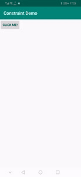
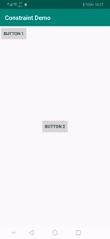
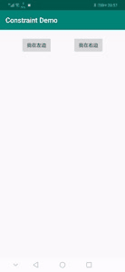
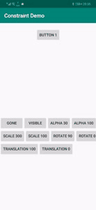

`ConstraintLayout`的横空出世，改变了`LinearLayout`、`RelativeLayout`一统天下的局面，同时也让我们的布局文件变得清爽，嵌套少了，渲染效率也提高了不少。`ConstraintLayout`带来的不仅仅是写布局文件上的变化，以往我们在代码中动态的修改布局中控件的大小、位置以及与其他控件的相对关系时，都需要使用到`LayoutParams`，不同的布局有对应的不同的`LayoutParams`的子类，使用起来十分繁琐。所以到了`ConstraintLayout`时代，与之搭配的就是`ConstraintSet`。

## 创建和初始化ConstraintSet

使用`ConstraintSet`要先创建对象，并通过`clone()`获取约束集，`clone()`有三种用法：

```kotlin
val constraintSet = ConstraintSet() //创建对象

//用法1：从ConstraintLayout实例中获取约束集，最常用的用法
constraintSet.clone(mainLayout) // 假设mainLayout是一个ConstraintLayout实例

//用法2：从布局中获取约束集
constraintSet.clone(context, R.layout.my_layout) // my_layout.xml的根布局必须是ConstraintLayout

//用法3：从其他约束集中获取约束集
constraintSet.clone(otherConstraintSet)
```

## 修改尺寸

`ConstraintSet`提供了一组方法用于设置控件的尺寸：

* constrainWidth(int viewId, int width)
* constrainHeight(int viewId, int height)
* constrainPercentWidth(int viewId, float percent)
* constrainPercentHeight(int viewId, float percent)

假设有个`button`原本的长宽都是`wrap_content`，要动态改变大小：

```kotlin
class MainActivity : AppCompatActivity() {

    override fun onCreate(savedInstanceState: Bundle?) {
        super.onCreate(savedInstanceState)
        setContentView(R.layout.activity_main)
        val constraintSet = ConstraintSet().apply {
            clone(main_layout)
            constrainWidth(R.id.button, dip2px(200f))
            constrainHeight(R.id.button, dip2px(80f))
        }

        button.setOnClickListener {
            TransitionManager.beginDelayedTransition(main_layout)
            //应用修改
            constraintSet.applyTo(main_layout)
        }
    }
}
```

> 约束被修改后，要通过`ConstraintSet.applyTo()`来应用修改




那么反过来，要重新设置回`wrap_content`呢：

```kotlin
constrainWidth(R.id.button, ConstraintSet.WRAP_CONTENT)
constrainHeight(R.id.button, ConstraintSet.WRAP_CONTENT)
```

这里要注意，是`ConstraintSet.WRAP_CONTENT`，不是以前的`LayoutParams.WRAP_CONTENT` !!!

同样的还有：`ConstraintSet.MATCH_CONSTRAINT`，表示根据约束条件自动适应至最大，等于与`android:layout_width="0dp"`

其他的跟尺寸有关的`API`还有：

* constrainDefaultWidth/constrainDefaultHeight
* constrainMaxWidth/constrainMaxHeight
* constrainMinWidth/constrainMinHeight

用来设置一些默认、最大最小尺寸，不常用，这里就不展开了。


## 修改约束
`ConstraintSet`最重要的用途就是用来修改约束，由于`ConstraintLayout`中，子控件的位置都是通过与父布局或者其他子控件的约束关系决定的，因此修改约束也等于调整了控件的位置。`ConstraintLayout`里面提供的所有跟约束有关的内容，`ConstraintSet`都有对应的`API`，其中比较重要的是：

### connect()
最基本的`API`，用于建立两个控件直接的约束关系：

```java
public void connect(int startID, int startSide, int endID, int endSide, int margin)
public void connect(int startID, int startSide, int endID, int endSide)
```

简单的理解：控件a（`startID`）的右边（`startSide`），要相对于控件b(`endID`)的左边(`endSide`)对齐

其中`startSide`和`endSide`用以下几种锚点常量表示：

```java
ConstraintSet.TOP
ConstraintSet.BOTTOM
ConstraintSet.LEFT
ConstraintSet.RIGHT
ConstraintSet.START
ConstraintSet.END
ConstraintSet.BASELINE //一般用于TextView
```

例如，布局中`button_1`原本位于左上角，要移到`button_2`的正上方，并与`button_2`左右对齐：



代码如下：

```kotlin
class MainActivity : AppCompatActivity() {

    override fun onCreate(savedInstanceState: Bundle?) {
        super.onCreate(savedInstanceState)
        setContentView(R.layout.activity_main)
        val constraintSet = ConstraintSet().apply {
            clone(main_layout)
            //button_1原本位于父布局左上角，要分别清理两处现有的约束
            clear(R.id.button_1, ConstraintSet.START)
            clear(R.id.button_1, ConstraintSet.TOP)
            
            //重新建立约束
            //让button_1低边至于button_2顶边，并有4dp的间隔
            connect(R.id.button_1, ConstraintSet.BOTTOM, R.id.button_2, ConstraintSet.TOP, dip2px(4f))
            //让button_1右边与button_2右边对齐，无需间隔
            connect(R.id.button_1, ConstraintSet.START, R.id.button_2, ConstraintSet.START)
            //让button_1左边与button_2左边对齐，无需间隔
            connect(R.id.button_1, ConstraintSet.END, R.id.button_2, ConstraintSet.END)
        }

        button_2.setOnClickListener {
            TransitionManager.beginDelayedTransition(main_layout)
            //应用修改
            constraintSet.applyTo(main_layout)
        }
    }
    
}
```

### center()
基于`connect`封装，让某一控件（`centerID`）置于另外两个控件（`firstID & secondID`）的中间：

```java
public void center(int centerID, int firstID, int firstSide, int firstMargin, int secondID, int secondSide, int secondMargin, float bias)
```

其中：

* `firstSide & secondSide`，必须是`ConstraintSet.TOP/ConstraintSet.BOTTOM`、`ConstraintSet.RIGHT/ConstraintSet.LEFT`、`ConstraintSet.START/ConstraintSet.END`，成对出现，否则布局会错乱
* `firstMargin & secondMargin`，提供了两个方向的间隔
* `bias`，表示偏移量，0～1表示，数值越小越向`firstID`靠近

例如：

```kotlin
//让button_2水平置于另外button_1和button_3的正中间
constraintSet.center(R.id.button_2, R.id.button_1, ConstraintSet.END, R.id.button_3, ConstraintSet.START， 0， 0， 0)
```

### centerHorizontally() && centerHorizontallyRtl()
基于`center()`的再次封装，让两个控件水平居中对齐，其中`centerHorizontallyRtl`用于`Rtl`布局

```java
public void centerHorizontally(int viewId, int toView)
public void centerHorizontallyRtl(int viewId, int toView)
```

例如：

```kotlin

//让button_2与button_1水平居中对齐
constraintSet.centerHorizontallyRtl(R.id.button_2, R.id.button_1)

//让button_2水平居中于父布局
constraintSet.centerHorizontallyRtl(R.id.button_2, ConstraintSet.PARENT_ID)
```


> Rtl表示需要兼容某些国家和地区（主要是阿拉伯）从右至左的书写阅读习惯，目前在Android Studio3中，在写xml布局文件的时候，所有用到left和right的地方，都会提示你改成start和end，就是Rtl的体现。


### centerVertically()
同样基于`center()`的再次封装，让两个控件垂直居中对齐

```java
public void centerVertically(int viewId, int toView)
```

例如：

```kotlin

//让button_2与button_1垂直居中对齐
constraintSet.centerVertically(R.id.button_2, R.id.button_1)

//让button_2垂直居中于父布局
constraintSet.centerVertically(R.id.button_2, ConstraintSet.PARENT_ID)
```

### others
以上是一些基本的约束，除此之外，还有很多其他的很约束有关的`API`比如：

* constrainCircle - 设置圆周约束
* createHorizontalChain/createHorizontalChainRtl/createVerticalChain - 设置水平/垂直链
* addToHorizontalChain/addToHorizontalChainRtl/addToVerticalChain - 加入水平/垂直链
* removeFromHorizontalChain/removeFromHorizontalChainRtl/removeFromoVerticalChain - 从水平/垂直链移除
* setHorizontalChainStyle/setVerticalChainStyle - 设置水平/垂直链的类型
* setHorizontalBias/setVerticalBias - 设置水平/垂直偏移
* setHorizontalWeight/setVerticalWeight - 设置水平/垂直权重
* setMargin/setGoneMargin - 设置间隔和约束对象消失后的间隔
* setGuidelineBegin/setGuidelineEnd/setGuidelinePercent - 设置参考线的相对位置
* setDimensionRatio - 设置宽高比
* clear - 清理约束

`ConstraintLayout`能做的一切，都在这里了。

## 切换布局
是不是觉得上面写太多代码了麻烦，那我们做两个布局切换好了：

`activity_main.xml`:

```xml
<?xml version="1.0" encoding="utf-8"?>
<android.support.constraint.ConstraintLayout xmlns:android="http://schemas.android.com/apk/res/android"
    xmlns:app="http://schemas.android.com/apk/res-auto"
    xmlns:tools="http://schemas.android.com/tools"
    android:id="@+id/main_layout"
    android:layout_width="match_parent"
    android:layout_height="match_parent"
    tools:context=".MainActivity">

    <Button
        android:id="@+id/button_right"
        android:layout_width="wrap_content"
        android:layout_height="wrap_content"
        android:layout_marginTop="20dp"
        android:text="我在右边"
        app:layout_constraintEnd_toEndOf="parent"
        app:layout_constraintStart_toEndOf="@+id/button_left"
        app:layout_constraintTop_toTopOf="parent" />

    <Button
        android:id="@+id/button_left"
        android:layout_width="wrap_content"
        android:layout_height="wrap_content"
        android:layout_marginTop="20dp"
        android:text="我在左边"
        app:layout_constraintEnd_toStartOf="@+id/button_right"
        app:layout_constraintStart_toStartOf="parent"
        app:layout_constraintTop_toTopOf="parent" />
</android.support.constraint.ConstraintLayout>
```
`activity_main_mirror.xml`:

```xml
<?xml version="1.0" encoding="utf-8"?>
<android.support.constraint.ConstraintLayout xmlns:android="http://schemas.android.com/apk/res/android"
    xmlns:app="http://schemas.android.com/apk/res-auto"
    xmlns:tools="http://schemas.android.com/tools"
    android:id="@+id/main_layout"
    android:layout_width="match_parent"
    android:layout_height="match_parent"
    tools:context=".MainActivity">

    <Button
        android:id="@+id/button_right"
        android:layout_width="wrap_content"
        android:layout_height="wrap_content"
        android:layout_marginTop="20dp"
        android:text="我本来在右边"
        app:layout_constraintEnd_toStartOf="@+id/button_left"
        app:layout_constraintStart_toStartOf="parent"
        app:layout_constraintTop_toTopOf="parent" />

    <Button
        android:id="@+id/button_left"
        android:layout_width="wrap_content"
        android:layout_height="wrap_content"
        android:layout_marginTop="20dp"
        android:text="我本来在左边"
        app:layout_constraintEnd_toEndOf="parent"
        app:layout_constraintStart_toEndOf="@+id/button_right"
        app:layout_constraintTop_toTopOf="parent"
         />
</android.support.constraint.ConstraintLayout>
```

`MainActivity.kt`：

```kotlin
class MainActivity : AppCompatActivity() {

    override fun onCreate(savedInstanceState: Bundle?) {
        super.onCreate(savedInstanceState)
        setContentView(R.layout.activity_main)
        val constraintSet1 = ConstraintSet().apply {
            clone(main_layout)
        }

        val constraintSet2 = ConstraintSet().apply {
            clone(this@MainActivity, R.layout.activity_main_mirror)
        }

        button_left.setOnClickListener {
            TransitionManager.beginDelayedTransition(main_layout)
            constraintSet2.applyTo(main_layout)
            button_left.text = "我本来在左边"
            button_right.text = "我本来在右边"
        }

        button_right.setOnClickListener {
            TransitionManager.beginDelayedTransition(main_layout)
            constraintSet1.applyTo(main_layout)
            button_left.text = "我在左边"
            button_right.text = "我在右边"
        }
    }
}
```
是不是很简单，效果如下：




## 修改控件属性
`ConstraintSet`不仅能修改尺寸、位置约束，还能做`LayoutParams`不能做的事情 -- 修改控件的各种属性，是不是很强大：

* setVisibility - 设置显隐
* setAlpha - 设置透明度
* setRotation/setRotationX/setRotationY - 设置旋转角度
* setScaleX/setScaleY - 设置缩放比例
* setTransformPivot/setTransformPivotX/setTransformPivotY - 设置变换中心点
* setTranslation/setTranslationX/setTranslationY/setTranslationZ - 设置偏移量
* setElevation - 设置阴影

可能有人会说，控件本身就有设置这些属性的方法，为什么要多此一举，那你就too young too naive了。

`ConstraintSet`做了那么多事情，只是为了一个目的：动画。让我们感受一下：


